# Evidence for First Incident Response Report

---

## Overview of attack

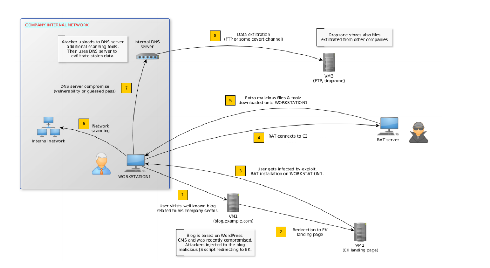

*Figura 1. Diagrama general del ataque (infección vía Exploit Kit, instalación del RAT, escaneo interno y exfiltración).*

A memory dump was taken shortly after the attack was discovered. The image was analyzed
utilizing Volatility. The following commands were run with results shown:

**Imageinfo:**

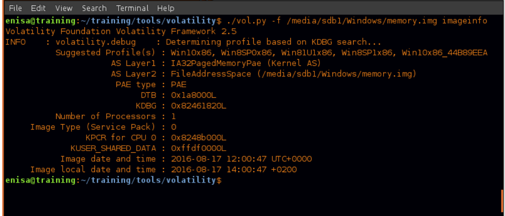

*Figura 2. Salida del plugin `imageinfo` de Volatility.*

```
Suggested Profile: Win10x86_44B89EEA
DTB:  0x1a8000L
KDBG: 0x8248b000L
KPCR: 0x8248b000L
```

From this point, Volatility will be run specifying these parameters:

```
--dtb=0x1a8000 --kdbg=0x82461820 --kpcr=0x8248b000 --profile=Win10x86_44B89EEA
```

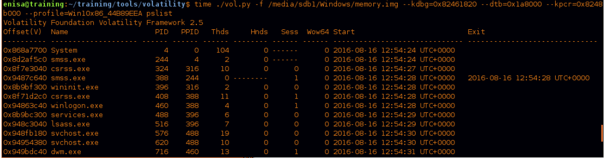

*Figura 3. Comando de Volatility con los parámetros especificados.*

Yara rules from previous known compromises were collected to be run against the memory image:

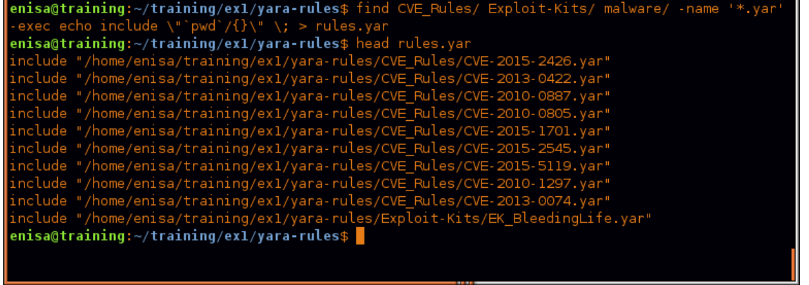

*Figura 4. Reglas YARA recopiladas de compromisos previos conocidos.*

The memory image was scanned using Volatility's `yarascan` plugin with the following results:

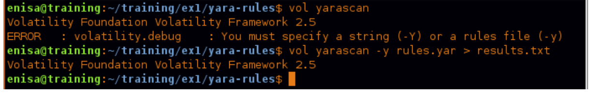

*Figura 5. Resultados del escaneo con `yarascan`.*

All of the rules that were triggered were counted:

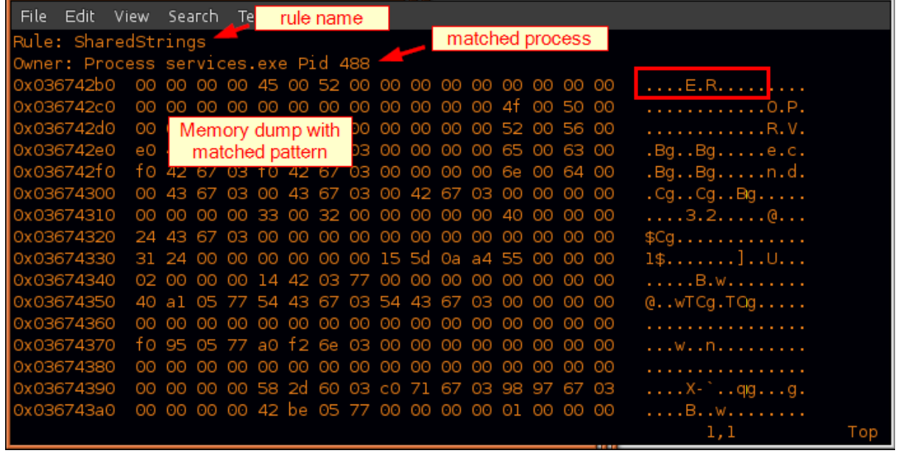

*Figura 6. Conteo de las reglas YARA activadas.*

It was determined that the hits for **SharedStrings** and **Spyeeye_plugins** were likely false
positives. The hits for **UPX** were possibly interesting as benign processes aren't usually UPX
packed. The hits for **With_Sqlite** were not definitive at this time because benign processes can
also use Sqlite. The hits for **Xtreme**, **xtreme_rat**, and **xtremrat** were considered interesting finds
because this is likely evidence of a malware execution.

The malicious processes involving Xtreme RAT were also the same processes that UPX packed
code were detected on. These three processes were:

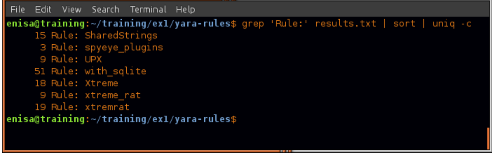

*Figura 7. Procesos donde se detectó código de Xtreme RAT / empaquetado UPX.*

**Suspected processes:**

- `svchost.exe` (Pid: 4888)
- `explorer.exe` (Pid: 4872)
- `update.exe` (Pid: 5172)

At this point it was determined that the system was infected with **Xtreme RAT** malware.

A process list scan was then run on the image with Volatility:

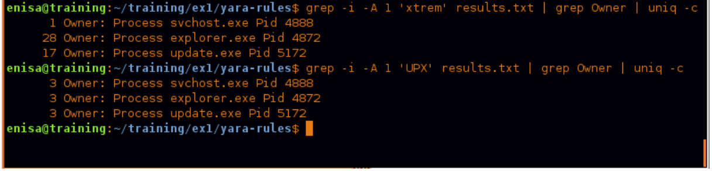

*Figura 8. Listado de procesos (`pslist`).*

Based on the System process start time, it was determined that the system was started at
**12:54:24 on 8-16-2016 (UTC)**.

The process list was further refined searching for the pids of the malicious processes found in
the previous step:

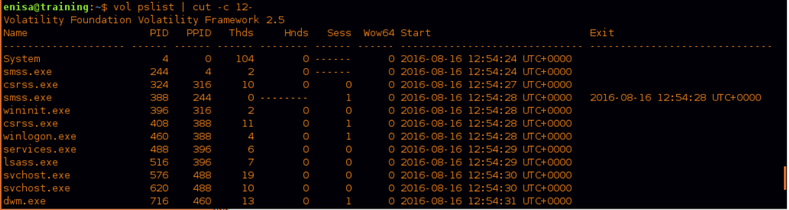

*Figura 9. Procesos maliciosos filtrados por PID.*

Parent pid was determined for the malicious processes:

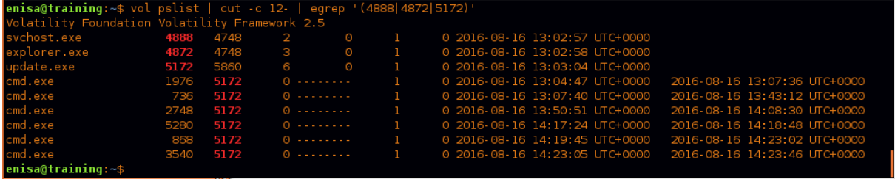

*Figura 10. PID padre de los procesos maliciosos.*

- `svchost.exe` (Pid: 4888) (Parent Pid: 4748)
- `explorer.exe` (Pid: 4872) (Parent Pid: 4748)
- `update.exe` (Pid: 5172) (Parent Pid: 5860)

It was determined that the malicious processes started shortly after system boot, around
**13:02:57**. At this point it is inconclusive if it is a fresh infection or something that was launched
by a persistence mechanism. It was further discovered that `update.exe` spawned several
command shells at the following times:

- 2016-08-16 13:07:36
- 2016-08-16 13:42:12
- 2016-08-16 14:08:30
- 2016-08-16 14:18:48
- 2016-08-16 14:23:02
- 2016-08-16 14:23:46

The `dlllist` Volatility plugin was then utilized to determine the command line which was used to
start each malicious process:

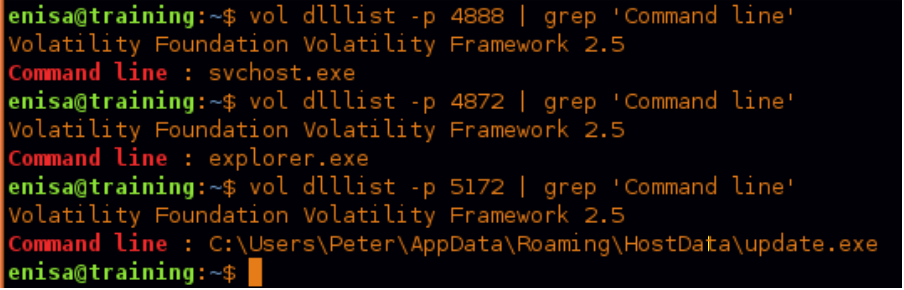

*Figura 11. Línea de comandos usada para iniciar cada proceso (`dlllist`).*

It was also determined that there were two explorer processes running on the system when
one explorer process is the norm.

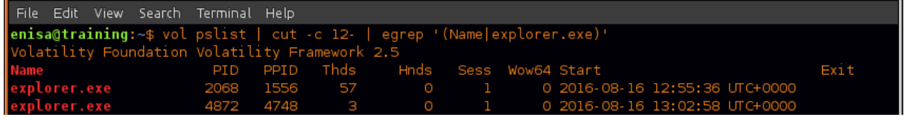

*Figura 12. Dos procesos `explorer.exe` en ejecución.*

`Explorer.exe` with PID 4872 was started using the original Windows executable, though it is not
the main `explorer.exe` process which was started when the user logged in (PID: 2068). This suggests
that malware is using a **RunPE** technique as a form of its disguise.

The memory image was then scanned for network connections using the `netscan` Volatility
plugin:


*Figura 13. Conexiones de red (`netscan`) — parte 1.*

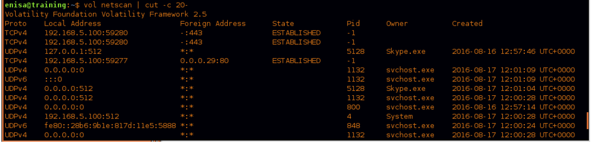

*Figura 14. Conexiones de red (`netscan`) — parte 2.*


*Figura 15. Conexiones de red (`netscan`) — parte 3.*

It was determined that some connections utilizing nonstandard TCP ports were created along
with traffic on TCP port 80 (HTTP) and 443 (HTTPS). Remote addresses and process IDs were
not able to be retrieved with this scan.

---

## Memory analysis summary

Based on basic memory analysis, the following was concluded:

- The system was most likely infected with **Xtreme RAT** malware whose code was found in
  the memory of at least three processes.
- Malware is possibly using **RunPE** technique to hide its presence in the system.
- Some connections to strange TCP ports were observed.
- The following paths to suspicious executables were found:
  - `%APPDATA%\HostData\update.exe`
- The following timestamps were noted:
  - 2016-08-16 13:02:57 UTC+0000 (start of `svchost.exe`)
  - 2016-08-16 13:02:58 UTC+0000 (start of `explorer.exe`)
  - 2016-08-16 13:03:04 UTC+0000 (start of `update.exe`)
  - 2016-08-16 13:07:36 UTC+0000 (start of `cmd.exe`)
  - 2016-08-16 13:42:12 UTC+0000 (start of `cmd.exe`)
  - 2016-08-16 14:08:30 UTC+0000 (start of `cmd.exe`)
  - 2016-08-16 14:18:48 UTC+0000 (start of `cmd.exe`)
  - 2016-08-16 14:23:02 UTC+0000 (start of `cmd.exe`)
  - 2016-08-16 14:23:46 UTC+0000 (start of `cmd.exe`)

---

## Disk image analysis

A full forensic disk image was also taken after the memory dump. The disk image was mounted
on a forensics workstation and several searches were done:

**Antivirus scan** – ClamAV was run against the mounted file system to search for known malware:

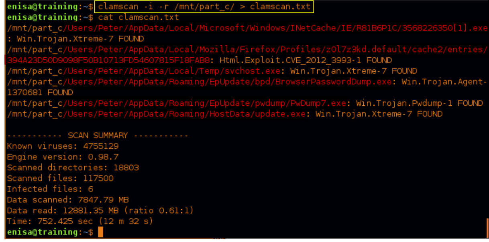

*Figura 16. Resultados del escaneo antivirus con ClamAV.*

- One file in the Firefox cache folder supposedly contains **CVE-2012-3993** exploit code, while
  another file in the INetCache folder (`3568226350[1].exe`) contains an executable with Xtreme
  RAT. This is a pretty valuable reference as it might point to the initial attack vector.
- There is a `svchost.exe` executable at `%TEMP%\svchost.exe` likely containing a copy of
  Xtreme RAT.
- Some suspicious executables are stored at `%APPDATA%\EpUpdate` directory.
- ClamAV scan confirmed that the previously found `%APPDATA%\HostData\update.exe`
  contains code of Xtreme RAT.

The **EpUpdate** directory contained multiple folders and tools possibly used during the attack:

- `bpd/` – BrowserPasswordDump.exe
- `mmktz/` – mimikatz
- `nircmd/` – NirCmd
- `nmap/` – Nmap
- `pwdump/` – Pwdump
- `ssh/` – plink, pscp
- `thc/` – THC Hydra
- `passwords.txt` – list of common passwords
- `wdigest.reg` – REG file changing `UseLogonCredential` value in WDigest registry subkey

It was further determined that at **13:10:03**, suspicious executable `54948tp.exe` was created at
`%TEMP%` path.

The web browser history was enumerated and it was determined that on the day of the
incident, **8/16/2016**, the user was visiting Reddit and then entered some website at the address
`http://blog.mycompany.ex/`. No other websites were visited directly by the user. Moreover it
was concluded that on the day of the investigation, domain `blog.mycompany.ex` was resolving
to **151.80.137.2**.


*Figura 17. Historial de navegación de Firefox del usuario.*

Examining the Firefox browser cache determined that shortly after visiting the
`blog.mycompany.ex` website, multiple other files were downloaded from another domain,
`blog.mysportclub.ex`.

The pattern of files downloaded from `blog.mysportclub.ex` suggests that it may be an Exploit
Kit. Further examination of `blog.mycompany.ex.htm` shows a strange script being called:

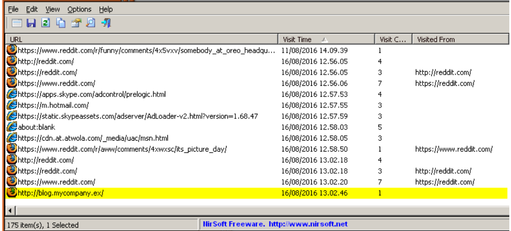

*Figura 18. Script sospechoso invocado en `blog.mycompany.ex.htm`.*

What this script does is an injection of an iframe element pointing to
`http://blog.mysportclub.ex/wp-content/uploads/hk/task/opspy/index.php`. This is a very
important observation because it tells us that the `blog.mysportclub.ex` website was most likely
infected with malicious code injecting an iframe element redirecting to an Exploit-Kit landing page.

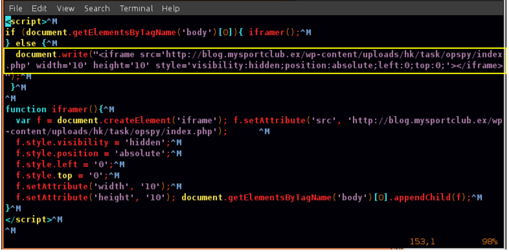

*Figura 19. Inyección del elemento iframe hacia la landing page del Exploit Kit.*

Further evidence of multiple exploits on the website can be found in the file
`/wp-content/uploads/hk/task/opspy/index.php` (previously saved to `blog.mysportclub.ex` as
`index.php.htm`).

It contains multiple `<iframe>` elements, each including a separate `.html`
file from `/wp-content/uploads/hk/task/opspy/` directory. Each html file contains a different
exploit code trying to exploit a different vulnerability.

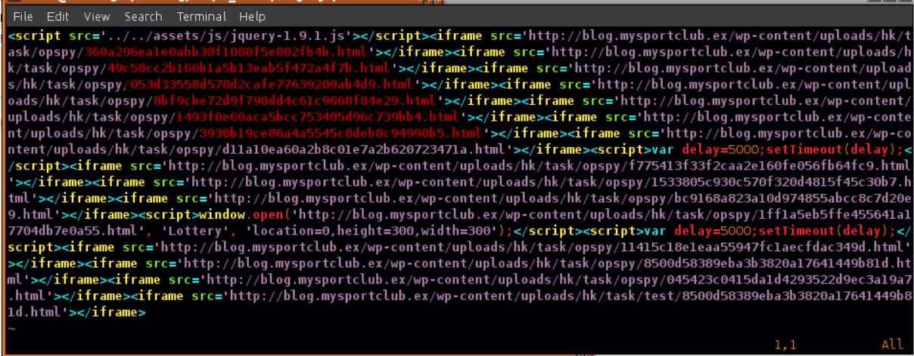

*Figura 20. Ficheros HTML de exploits que referencian `svchost.exe`.*

Searching for `svchost.exe` in the downloaded exploit code will show that 3 of the attempted
exploits mention `svchost.exe`.

In the first file, there is additional code that will download and execute the `3568226350.exe` file
that was located on the system in the `%tmp%` directory.

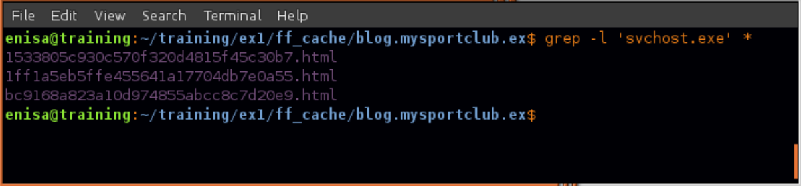

*Figura 21. Código que descarga y ejecuta `3568226350.exe`.*

---

## Filesystem analysis findings and conclusions

- Xtreme RAT process found in the system is likely a result of infection through a
  malicious website, which the user possibly visited using the Firefox web browser.
- At **13:02:57**, `svchost.exe` executable was created inside the `%TEMP%` directory.
- The `Update.exe` executable had its timestamps overwritten.
- `%APPDATA%\EpUpdate` folder contains multiple tools that can be used for system and
  network profiling. It is unknown if any of those tools were actually executed.
- The `%APPDATA%\EpUpdate` folder was created at **13:14:47**.
- At **13:10:03**, suspicious executable `54948tp.exe` was created at `%TEMP%` path.

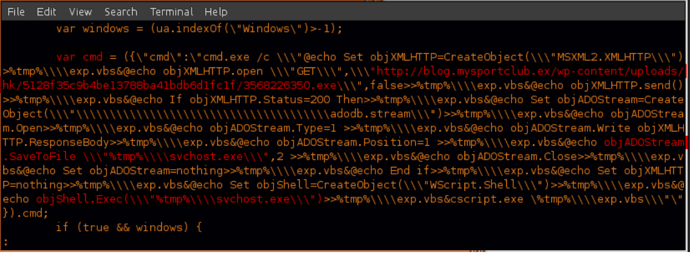

*Figura 22. Patrón de descargas tipo Exploit-Kit en la caché de Firefox.*

## Application logs analysis findings and conclusions

- At **13:03:16** a Firefox crash report related to the Flash plugin was generated.
- From Firefox history it can be concluded that prior to the incident the user was browsing
  Reddit and then visited `blog.mycompany.ex` website (**13:02:46**).
- Analysis of Firefox cache files revealed a pattern typical for Exploit-Kits – multiple
  similarly named `.html` files from `blog.mysportclub.ex` were downloaded after visiting
  `blog.mycompany.ex`.
- Analysis of the cached `blog.mycompany.ex` index revealed it contains an `<iframe>` element
  referring to `http://blog.mysportclub.ex/wp-content/uploads/hk/task/opspy/index.php`.
- At least some of the `.html` files from `http://blog.mysportclub.ex/wp-content/uploads/hk/task/opspy/`
  contain code downloading some executable (`3568226350.exe`) and saving it to `%TMP%\svchost.exe`
  — what correlates with the previous finding of `svchost.exe` being created in the filesystem around the same time.
- Time of visit to `blog.mycompany.ex` correlates with the time of creation and execution
  of the `update.exe` process (Xtreme RAT).

---

## Analysis of 3568226350.exe

Upon further analysis, the `3568226350.exe` file is determined to be a PE32 executable most
likely built from a Python script using a `py2exe` tool. The Python script can then be
decompiled. When looking at the decompiled code we see:

A `DOWNLOAD_URL` global variable pointing to `data_32.bin` on `blog.mysportclub.ex`. Shortly
after that there is a decryption function defined.

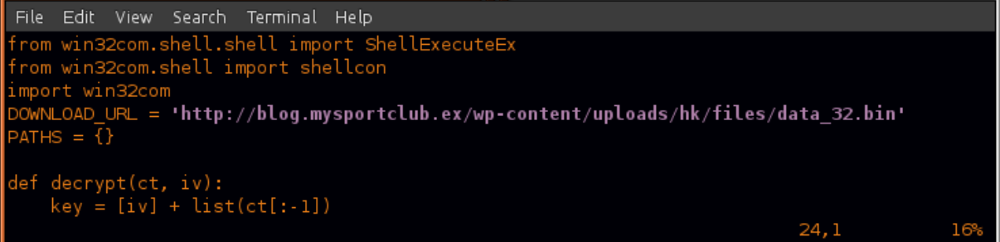

*Figura 23. Variable `DOWNLOAD_URL` y función de descifrado en el código decompilado.*

In the middle of the code there is a `get_toolz` function defined (called from the main function).
This function first downloads the file from `DOWNLOAD_URL`, decrypts it and then
decompresses its contents into the `%APPDATA%\EpUpdate` directory.

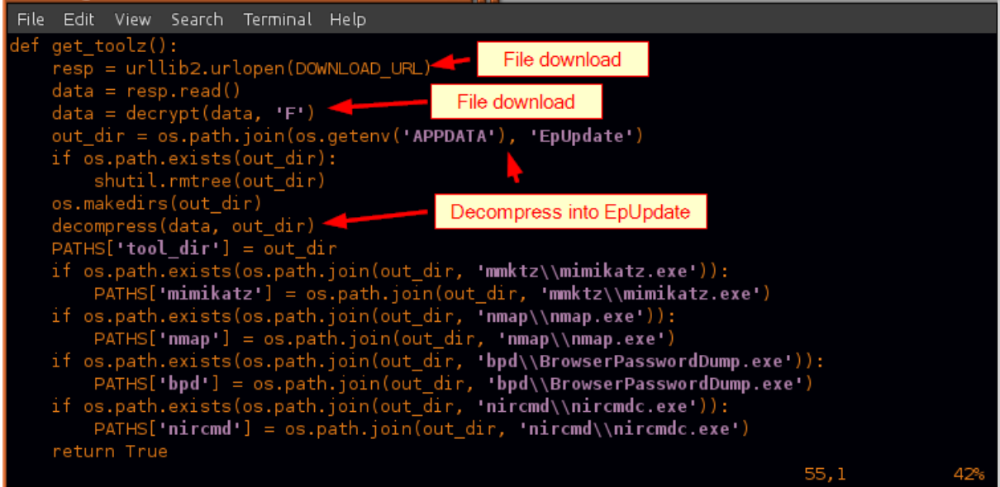

*Figura 24. Función `get_toolz` que descarga, descifra y descomprime las herramientas.*

In the main function there is `SystemProfile` in `%TMP%` directory referenced (`data_dir`). Then
Mimikatz and Bpd tools are automatically executed.

Inspection of `%TMP%\SystemProfile` revealed that this directory contains a group of `.log` files.
Beside `bpd.log` and `mimikatz.log` that were created around **13:14:48** as a result of execution of
the analysed Python script, there is also a `netscan/` directory and `sysinfo.txt` file. What's more, both
were created several minutes later at **13:34:25** and **13:52:21**.

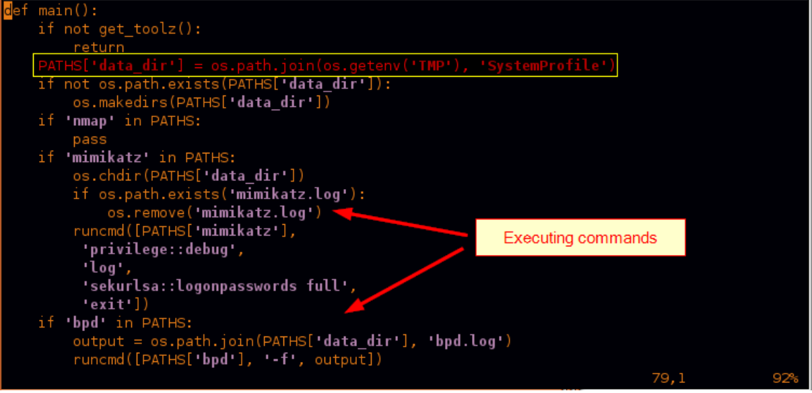

*Figura 25. Contenido de `%TMP%\SystemProfile`.*

The `netscan/` directory seems to contain port scan results of three hosts on the local network:
**192.168.5.1**, **192.168.5.10**, **192.168.5.15**.

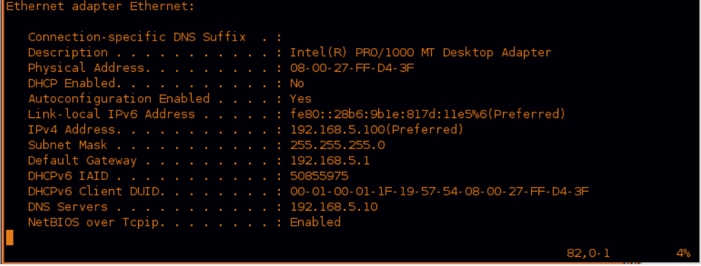

*Figura 26. Resultados de escaneo Nmap en el directorio `netscan/`.*

From the `.xml` files it can be read that network scanning was done at **13:59:29**, **13:59:34**, and
**13:59:36** using Nmap 7.12 from the EpUpdate directory. Exact command used to start scanning can
be also read.

## 54948tp.exe decompilation findings and conclusions

- `54948tp.exe` is a Python script built with `py2exe`.
- Script downloads a file from the same network location where the Exploit-Kit was located
  (`http://blog.mysportclub.ex/wp-content/uploads/hk/files/data_32.bin`) and then
  unpacks its contents to `%APPDATA%\EpUpdate`. Downloaded file contains a toolset later
  used by the attacker (e.g. nmap scanner).
- `54948tp.exe` was most likely executed between **13:10:03** (creation of `54948tp.exe` on
  disk) and **13:14:47** (creation of EpUpdate directory).
- `54948tp.exe` creates `%TMP%\SystemProfile` to which result files are saved.
- Based on log files found in the SystemProfile directory the analyst can assume that the attacker was
  interested in gathering information about the infected system and local network (port scans).
- Network scans were performed around **13:59:XX** UTC.
- At **13:34:25** (creation time of `sysinfo.txt` file) possibly some local
  commands gathering information about the local system were executed.

---

## Prefetch analysis

Prefetch analysis was done on the collected prefetch files.

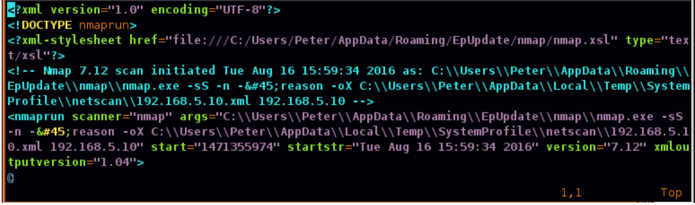

*Figura 27. Análisis de los archivos Prefetch recopilados.*

At the time of the incident, `update.exe` was run two times at **13:03:03** and **13:03:04**.

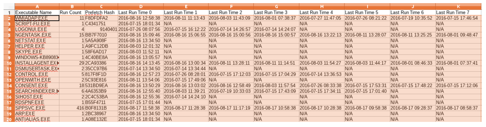

*Figura 28. Ejecuciones de `update.exe` registradas en Prefetch.*

Next at **13:10:13** the `54948tp.exe` binary was executed and shortly after that at **13:14:47**
`mimikatz.exe` and `browserprocessdump.exe` were also run. This confirms that `54948tp.exe` was
not only created on the hard disk but also executed.

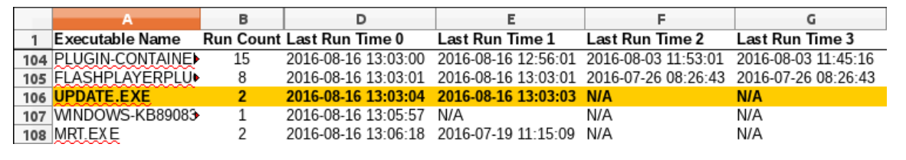

*Figura 29. Ejecución de `54948tp.exe`, `mimikatz.exe` y `browserprocessdump.exe`.*

Next, between **13:34:25** and **13:34:51** multiple standard tools returning information about the local
system were executed. This corresponds to the creation time (13:34:25) and last write time
(13:49:59) of the `SystemProfile\sysinfo.txt` file. What's interesting is that `whoami.exe` and
`ipconfig.exe` tools were also executed earlier between **13:08:00** and **13:10:00**. This echoes what
was discovered with the memory image analysis, at **13:07:36** UTC a `cmd.exe` process was
created.

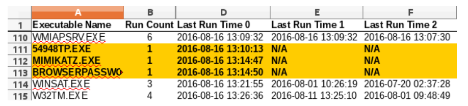

*Figura 30. Ejecución de herramientas estándar de recopilación de información del sistema.*

At **13:59:34** binary `nmap.exe` was executed for the last time. The other two executions
correspond to the reported port scan times. However, it should be noted that nmap was also
executed earlier around **13:56:xx**. Shortly after that at **14:04:44** `hydra.exe`, a tool used for
dictionary/brute force attacks against remote services, was also executed.

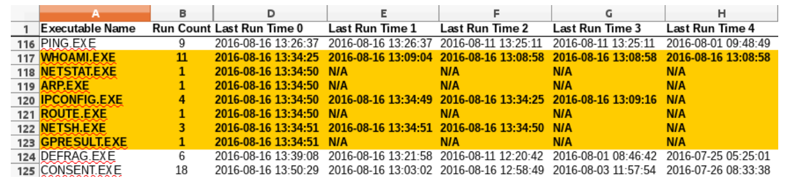

*Figura 31. Ejecución de `nmap.exe` y `hydra.exe` registrada en Prefetch.*

Finally, `plink.exe` and `pscp.exe` were also executed. `Plink.exe` was executed six times in total:
**14:10:49**, **14:11:20**, **14:17:45**, **14:20:44**, **14:22:45** and **14:23:31**. Then `pscp.exe` was executed at
**14:47:12**, **14:47:54**, and **14:50:09**. This suggests that someone might have been trying to log in
to some remote host (`plink.exe`) and then possibly transfer some data in/out (`pscp.exe`).
Sequence of the events (`nmap` -> `hydra` -> `plink`/`pscp`) suggests that the attacker possibly first tried
to scan the local network with nmap and then used hydra to crack the password to some host on the
network. At this point this is however only a speculation and would need further verification
with the analysis of network logs.

## Prefetch analysis findings and conclusions

- Prefetch analysis confirmed some of the previous findings like execution of `update.exe`
  (Xtreme RAT) at **13:03:04** or execution of `54948tp.exe` at **13:10:13**.
- Between **13:34:25** and **13:34:51** a group of system commands were executed to gather
  information about the local system.
- At **14:04:44** the Hydra tool was executed. Possibly to perform some dictionary attack.
- `Plink.exe` tool was executed six times between **14:10:49** and **14:23:31**. Possibly to login
  to some remote system.
- At **14:50:19** the PSCP tool was executed. Possibly to download or upload some data to a
  remote host.

---

## Event log analysis (THC Hydra)

A search was conducted of all events that were logged between **14:03:00** and **14:05:00** because
THC Hydra was executed in that time frame.

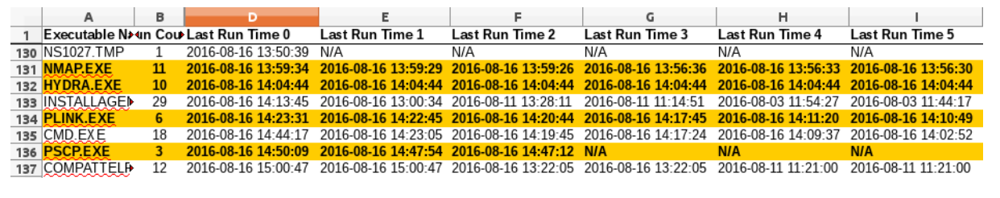

*Figura 32. Eventos 4798 relacionados con la ejecución de `hydra.exe`.*

Three events were notable, two of which mention `hydra.exe` in the EventData section. The
EventID for both events is **4798** and they were logged respectively at **14:03:21** and **14:04:43** –
that is the time when `hydra.exe` was executed (as found during prefetch analysis). Event 4798
informs that *"A user's local group membership was enumerated"*.

One more 4798 event was found, logged at **14:02:04** – one minute before the time period chosen for
the first query.

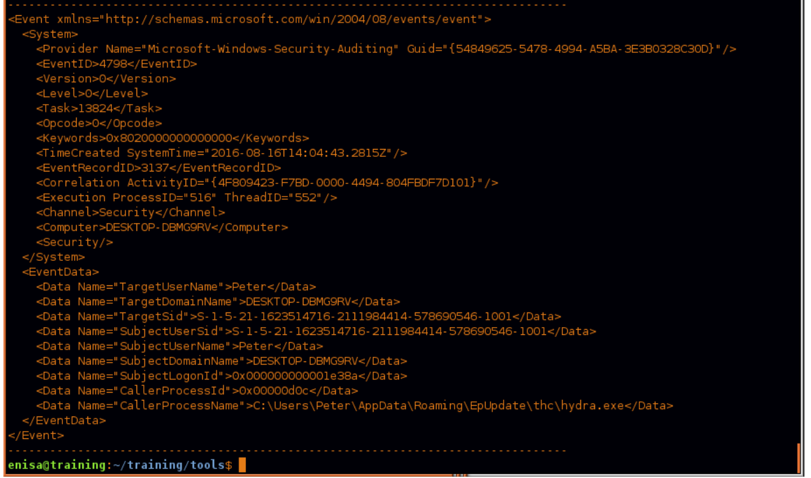

*Figura 33. Evento 4798 adicional registrado a las 14:02:04.*

---

## Registry analysis (RegRipper / WRR)

Utilizing RegRipper with the `regtime` plugin, `NTUSER.DAT` was inspected. At **13:02:57** the `Run`
and `RunOnce` subkeys (used for autostarting applications when the user logs in to the system) were
modified. Additionally, at **13:03:10** a subkey named `GhCtxq8t` was also modified.

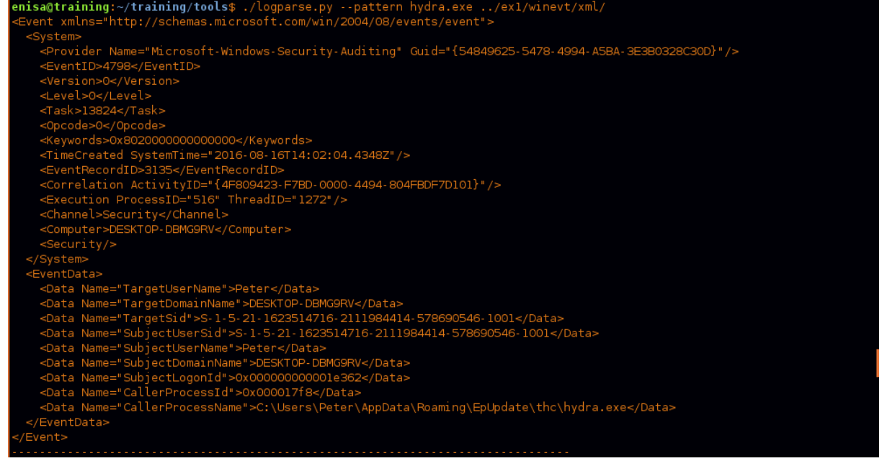

*Figura 34. Timeline del registro (`NTUSER.DAT`) generado con RegRipper.*

Further inspection of `NTUSER.DAT` with the WRR tool reveals that `GhCtxq8t` looks to be used
by the `update.exe` process. The `FirstExecution` value of the `GhCtxq8t` subkey confirms previous
observations that `update.exe` was installed in the system and executed for the first time at
**13:03:10** UTC (**15:03:10** local time).

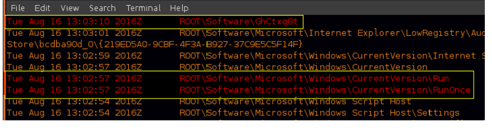

*Figura 35. Subclave `GhCtxq8t` asociada al proceso `update.exe` (WRR).*

Further analysis of the registry timeline created from `NTUSER.DAT` reveals that PuTTY-related
subkeys were modified at **14:11:26** which corresponds to the time of `Plink.exe` execution (as
found during prefetch analysis).

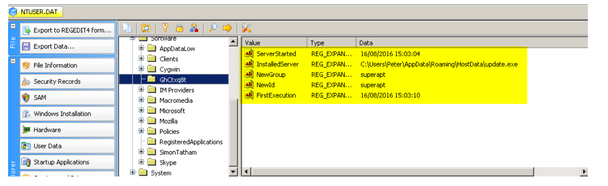

*Figura 36. Subclaves relacionadas con PuTTY modificadas a las 14:11:26.*

Analysis of the subkey `SSHHostKeys` shows it contains a single value with an RSA key from
**192.168.5.10**.

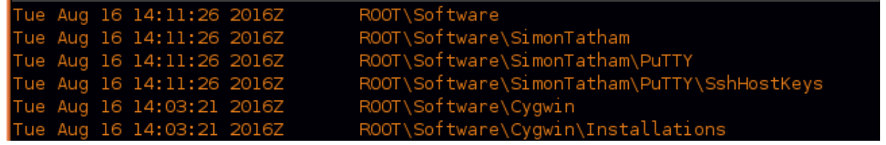

*Figura 37. Subclave `SSHHostKeys` con la clave RSA de 192.168.5.10.*

Based on an examination of what software was installed on the system by looking at Uninstall
information in the registry, it was discovered that the system had an outdated version of Mozilla
Firefox (**33.0.3**) and the Adobe Flash Plugin (**18.0.0.194**). This might have played an important role
in the workstation infection after the user visited the malicious website.

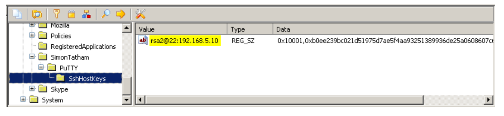

*Figura 38. Software instalado según la información de desinstalación del registro (1).*

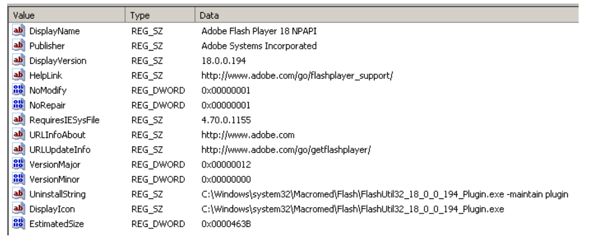

*Figura 39. Versión desactualizada de Mozilla Firefox (33.0.3).*

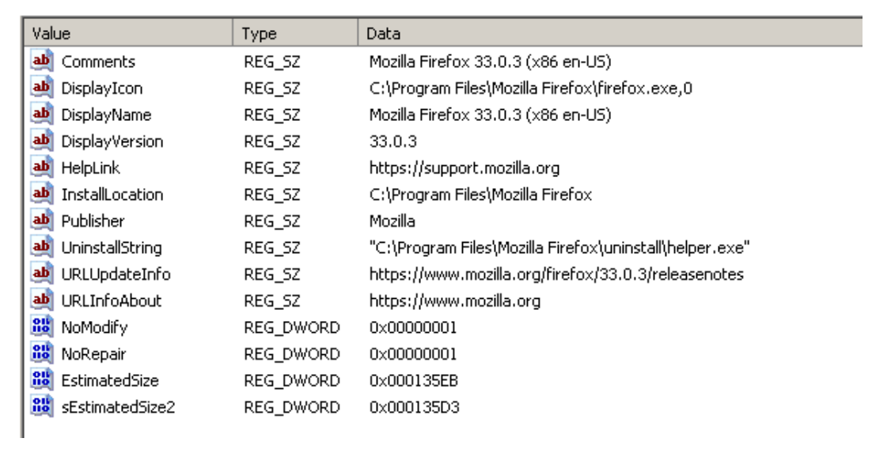

*Figura 40. Versión desactualizada de Adobe Flash Plugin (18.0.0.194).*

---

## Overall Event Timeline

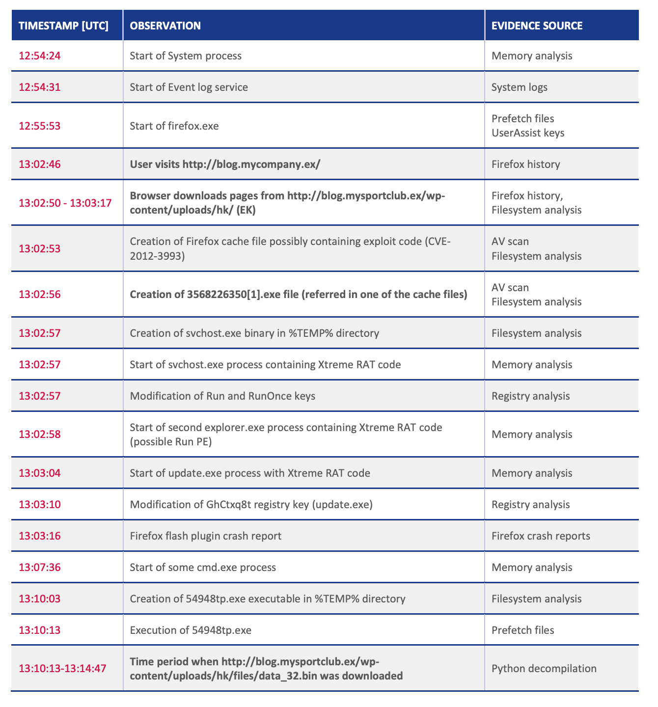

*Figura 41. Cronología general de eventos — parte 1.*

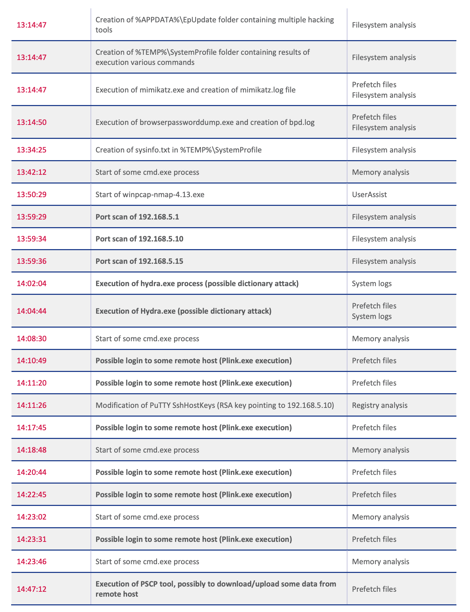

*Figura 42. Cronología general de eventos — parte 2.*

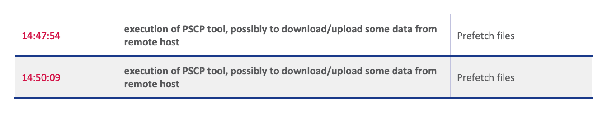

*Figura 43. Cronología general de eventos — parte 3.*

---

## Indicators of Compromise (IOCs)

| Tipo | Indicador |
|------|-----------|
| Malware | Xtreme RAT |
| Proceso | `svchost.exe` (Pid 4888), `explorer.exe` (Pid 4872), `update.exe` (Pid 5172) |
| Ruta | `%APPDATA%\HostData\update.exe` |
| Ruta | `%TEMP%\svchost.exe` |
| Ruta | `%APPDATA%\EpUpdate\` (bpd, mimikatz, nircmd, nmap, pwdump, ssh, thc, passwords.txt, wdigest.reg) |
| Ruta | `%TEMP%\54948tp.exe` |
| Ruta | `%TMP%\SystemProfile\` |
| Fichero | `3568226350.exe` / `3568226350[1].exe` (PE32 py2exe) |
| Dominio | `blog.mycompany.ex` → 151.80.137.2 (sitio comprometido) |
| Dominio | `blog.mysportclub.ex` (Exploit Kit) |
| URL | `http://blog.mysportclub.ex/wp-content/uploads/hk/task/opspy/index.php` |
| URL | `http://blog.mysportclub.ex/wp-content/uploads/hk/files/data_32.bin` |
| CVE | CVE-2012-3993 |
| Subclave registro | `GhCtxq8t` (persistencia de update.exe) |
| Red interna | 192.168.5.1, 192.168.5.10, 192.168.5.15 |
| Software vulnerable | Mozilla Firefox 33.0.3, Adobe Flash Plugin 18.0.0.194 |
